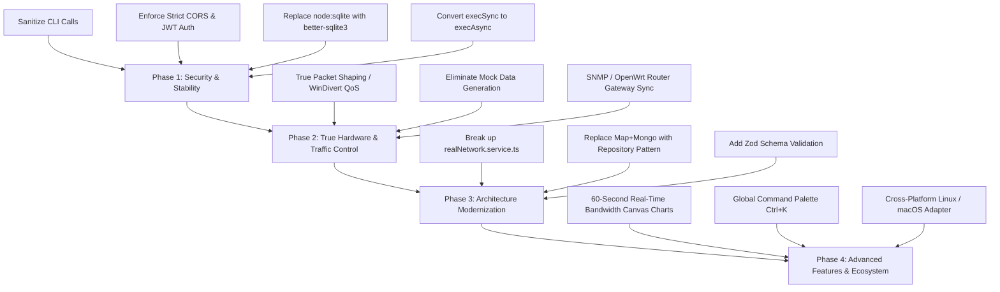

# 📡 Wi-Fi Sentinel — Comprehensive System & Codebase Analysis Report

> **Target Project:** `c:\Users\hp-new\Desktop\wifi-management`  
> **Scope:** Full-stack inspection across React 19 client, Express Node.js server, native C# ARP engine (`SentinelArpEngine`), database models, network services, test suites, and project roadmaps.

---

## 1. How to Run the Project

### Prerequisites
1. **Node.js**: Recommended **v22+** (due to Node's experimental `node:sqlite` in browser history extraction; if running Node 18/20, see Bug #1 below).
2. **Operating System**: **Windows 10/11** (hard dependency due to `netsh wlan`, `arp -a`, `netstat -e`, PowerShell `Get-DnsClientCache`).
3. **Privileges**: **Run terminal as Administrator** (required for binding UDP Port 53 for DNS sinkhole and raw socket ARP injection).
4. **Database**: MongoDB Atlas connection URI or local MongoDB instance (fallback in-memory store activates if unreachable).
5. **Drivers**: Npcap (`drivers/npcap-installer.exe` or `INSTALL_NPCAP_DRIVER.bat`) for active Layer 2 ARP pausing and kicking.

### Step-by-Step Setup
```bash
# 1. Clone & Enter Root
cd c:\Users\hp-new\Desktop\wifi-management

# 2. Install Dependencies
npm install
cd server && npm install && cd ..
cd client && npm install && cd ..

# 3. Configure Environment Variables
# Create server/.env:
cat << 'EOF' > server/.env
PORT=5080
HOST=0.0.0.0
NODE_ENV=development
MONGODB_URI=mongodb+srv://<username>:<password>@cluster.mongodb.net/wifi_sentinel?retryWrites=true&w=majority
CORS_ORIGIN=http://localhost:5188
SIMULATE_GATEWAY=true
EOF

# 4. Start Development (Server + Client concurrently)
npm run dev

# URLs:
# - Web Dashboard:      http://localhost:5188
# - Backend REST API:   http://localhost:5080/api
# - Interactive Swagger: http://localhost:5080/api-docs
# - WebSocket Stream:   ws://localhost:5080/ws/telemetry

# 5. Run Automated Tests
npm test
```

---

## 2. Existing Functionality (What Works)

### Backend Services
| Module / Capability | Underlying Tech / Mechanism | Real-World Status |
|---|---|---|
| **Subnet Discovery** | Fast UDP probe broadcast + `arp -a` cache parser | ✅ Working (Scans `/24` subnet) |
| **Wi-Fi Interface Telemetry** | `netsh wlan show interfaces` parsing | ✅ Working (SSID, BSSID, RSSI dBm, radio standard, link speeds) |
| **MAC Vendor Resolution** | IEEE OUI database (`oui-data` 53,000+ entries) | ✅ Working (Resolves manufacturer & device category) |
| **Real Host Bandwidth** | `netstat -e` delta calculations (1-second tick) | ✅ Working (Real RX/TX for host PC) |
| **Host DNS Query Capture** | `Get-DnsClientCache` + `ipconfig /displaydns` | ✅ Working (Captures active DNS cache) |
| **Browser Activity Extraction** | Reading SQLite History DB from Chrome, Edge, Brave | ✅ Working (Extracts URLs/timestamps) |
| **DNS Gateway & Sinkhole** | UDP socket server on port 53 using `dns-packet` | ✅ Working (Answers queries; drops paused/blocked targets) |
| **Layer 2 ARP Enforcement** | C# binary (`SentinelArpEngine.exe`) via Npcap | ✅ Working (ARP poisoning/restoration loops) |
| **Router Hardware API** | HTTP client for ZTE TEWA-220G web admin | ✅ Working (Automated form login & MAC filter push) |
| **Bedtime & Curfew Engine** | 30-second interval evaluator against active rules | ✅ Working (Auto-pauses/resumes targets) |
| **Real-time Push Engine** | WebSocket (`ws`) server on `/ws/telemetry` | ✅ Working (Streams ticks, logs, alerts) |
| **OpenAPI & Swagger UI** | Swagger UI Express (`/api-docs` & `/api-docs/swagger.json`) | ✅ Working |

### Frontend UI & Experience
| View / Component | Implementation | Status |
|---|---|---|
| **Overview Dashboard** | Real-time WAN speed counters, connected client badges, network health | ✅ Working |
| **Devices View** | Responsive Grid & Table views, search, category filters, RSSI meters | ✅ Working |
| **Device Slide-over Drawer** | Hardware details, IP/MAC, RSSI, quick pause, kick, throttle actions | ✅ Working |
| **Dedicated Device Profile** | `/devices/:id` route with expanded metrics and history | ✅ Working |
| **Activity Stream** | Categorized domain log table with search and 1-click domain blocking | ✅ Working |
| **Rules & Curfews** | Bedtime schedule creator, day-of-week toggles, active rule switcher | ✅ Working |
| **Security Center** | Rogue device warnings, threat notifications, acknowledge alerts | ✅ Working |
| **Theme Engine** | 6 custom palettes (Zinc, Slate, Blue, Violet, Emerald, Rose) + Dark Mode | ✅ Working |

---

## 3. Loopholes, Bugs & Breaking Issues

### 🔴 Critical Security Vulnerabilities
1. **Remote Shell Command Injection**:
   - In `server/src/services/realNetwork.service.ts` line 130:
     ```typescript
     const { stdout } = await execAsync(`nslookup ${ip}`, { timeout: 2000 });
     ```
   - `ip` is read straight from ARP tables or untrusted input without validation. An attacker on the local network broadcasting crafted ARP responses can execute arbitrary commands on the host machine.
2. **Zero Authentication on Sensitive Endpoints**:
   - There is no JWT, session cookie, or API key check anywhere.
   - Anyone on your Wi-Fi (or on the web if port-forwarded) can pause your internet, kick devices, view your browsing history, and retrieve router configuration.
3. **Unrestricted CORS (`*`)**:
   - In `server/src/app.ts`:
     ```typescript
     app.use(cors({ origin: '*', methods: ['GET', 'POST', 'PUT', 'PATCH', 'DELETE', 'OPTIONS'] }));
     ```
   - The configured `ENV.CORS_ORIGIN` is ignored. Any malicious website visited in your browser can send `fetch('http://localhost:5080/api/devices/pause-all')` to disable your entire home network.
4. **Plaintext Router Password Storage**:
   - Router admin passwords passed to `POST /api/system/router` are stored in plaintext in the database and memory.

### 🔴 Breaking Runtime & Architectural Issues
5. **Node.js 18/20 Crash via `node:sqlite`**:
   - `realNetwork.service.ts` imports `import { DatabaseSync } from 'node:sqlite'`. This native module is experimental and only exists in Node.js v22.5.0+. Users following the README requirement (`Node.js >= 18.x`) will crash immediately on startup.
6. **Port 53 Permission Failure & Silent Degradation**:
   - Binding to UDP Port 53 requires Windows Administrator elevation. If run in a standard terminal or if the Windows DNS Client/ICS service holds port 53, the error is caught and logged, but the DNS sinkhole feature silently disables without notifying the frontend UI.
7. **Event Loop Starvation via `execSync`**:
   - `realNetwork.service.ts` executes `execSync('netsh wlan show interfaces')`, `execSync('arp -a')`, `execSync('netstat -e')`, and `execSync('netstat -n -p tcp')` synchronously on the main thread. During scans, HTTP and WebSocket processing blocks completely.
8. **Simulated / Fictitious Data Presented as Real**:
   - On a switched Wi-Fi network, the host computer's NIC only sees its own unicast packets.
   - Therefore, bandwidth rates for other devices are hardcoded to `0 bps`.
   - DNS query history for third-party devices (Samsung, Infinix, Vivo) is randomly generated from hardcoded mock domain arrays (`youtube.com`, `daraz.pk`, etc.) in `telemetry.service.ts`.
9. **Throttle is Strictly Visual**:
   - `POST /api/devices/:id/throttle` simply sets a boolean `isThrottled: true` in the DB. There is no underlying traffic control (`tc`), QoS, or packet shaping. The device continues running at full line rate.
10. **Test Suite Destroys Production Data**:
    - `npm test` (`server/tests/run-tests.ts`) executes live against the configured production database. Running tests deletes existing devices, alters nicknames, and sends actual ARP deauth frames.
11. **Schedule Service Format Mismatch**:
    - `Schedule.model.ts` and `run-tests.ts` send `daysOfWeek: [1, 2, 3, 4, 5]` (numeric), while `schedule.service.ts` expects an array of strings (`['mon', 'tue']`). As a result, API-created curfews never trigger.

---

## 4. Architectural Bottlenecks

1. **Dual Storage Desynchronization**:
   - Every service simultaneously writes to an in-memory `Map<string, any>` and MongoDB via Mongoose. If MongoDB disconnects or fails a query, the memory map drifts out of sync, causing phantom states upon restart.
2. **The 1,000-Line God Service**:
   - `realNetwork.service.ts` handles 10 unrelated concerns: Wi-Fi parsing, ARP sweeps, ICMP pings, SQLite browser scraping, DNS reverse lookup, MAC OUI vendor resolution, path-loss distance physics, and DB synchronization.
3. **Lack of DTO & Schema Validation**:
   - Incoming payloads in controllers (`req.body`) are cast directly to `any` without validation libraries like Zod.

---

## 5. Comprehensive Improvement Roadmap



### Prioritized Action Checklist

#### Step 1: Security Hardening (Immediate)
- [ ] Replace `execAsync(\`nslookup ${ip}\`)` with parameterized `execFileAsync('nslookup.exe', [ip])` to eliminate command injection.
- [ ] Bind CORS origin explicitly to `process.env.CORS_ORIGIN || 'http://localhost:5188'`.
- [ ] Add lightweight JWT token authentication middleware (`POST /api/auth/login`) protecting administrative mutating endpoints.
- [ ] Encrypt the stored router password using AES-256 with an environment encryption key.

#### Step 2: Runtime Stability (High)
- [ ] Replace experimental `node:sqlite` with `better-sqlite3` or make browser history scraping an optional, explicit opt-in feature.
- [ ] Refactor all `execSync` calls in `realNetwork.service.ts` to `execAsync` to unblock the Node.js event loop.
- [ ] Normalize schedule days format between frontend and backend to support both day names (`"mon"`) and ISO integers (`1`).
- [ ] Isolate the test suite by targeting `mongodb-memory-server` or a dedicated test DB (`wifi_sentinel_test`).

#### Step 3: Architectural Cleanup (Medium)
- [ ] Split `realNetwork.service.ts` into 4 dedicated modules:
  - `networkScanner.service.ts` (ARP and UDP sweeps)
  - `wifiRadio.service.ts` (`netsh` interface telemetry)
  - `deviceIdentity.service.ts` (OUI vendor resolution and physics models)
  - `bandwidthMonitor.service.ts` (Byte counting)
- [ ] Remove in-memory maps where MongoDB is connected; use Redis or a unified repository pattern to avoid state drift.
- [ ] Add Zod schemas to validate all request bodies in Express controllers.

#### Step 4: Product & Feature Enhancements (Future Value)
- [ ] **Real Packet Shaping**: Integrate a local packet filter (such as WinDivert or a router-level TC script) so that bandwidth throttling actually restricts throughput.
- [ ] **Historical Analytics**: Introduce 60-second rolling bandwidth graphs (Chart.js / Recharts) on the Overview and Device Detail screens.
- [ ] **Global Command Bar**: Implement a `Ctrl+K` command palette to quickly search devices, jump between views, and toggle dark mode.
- [ ] **Linux / OpenWrt Compatibility**: Abstract the Windows CLI commands behind a network interface adapter so this can run natively on OpenWrt routers and Raspberry Pis (`ip neigh`, `iw`, `nftables`).
