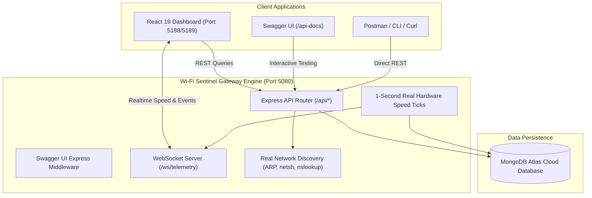

# 🌐 Wi-Fi Sentinel — Complete API & Swagger Reference

> **Interactive Swagger UI:** [`http://localhost:5080/api-docs`](http://localhost:5080/api-docs)  
> **OpenAPI 3.0.3 JSON Spec:** [`http://localhost:5080/api-docs/swagger.json`](http://localhost:5080/api-docs/swagger.json) or [`docs/openapi.json`](file:///c:/Users/hp-new/Desktop/wifi-management/docs/openapi.json)  
> **WebSocket Telemetry Gateway:** `ws://localhost:5080/ws/telemetry`

---

## 📑 Table of Contents

1. [Architectural Overview](#-architectural-overview)
2. [Interactive Swagger UI Guide](#-interactive-swagger-ui-guide)
3. [Postman & Tooling Import](#-postman--tooling-import)
4. [Authentication & Network Security](#-authentication--network-security)
5. [REST API Endpoints Reference](#-rest-api-endpoints-reference)
   - [Health Check](#health-check)
   - [Device Discovery & Management](#device-discovery--management)
   - [Network-Wide Emergency Controls](#network-wide-emergency-controls)
   - [Traffic & DNS Parental Controls](#traffic--dns-parental-controls)
   - [Bedtime & Focus Schedules](#bedtime--focus-schedules)
   - [Security Threat Alerts](#security-threat-alerts)
   - [System & Wi-Fi Mesh Telemetry](#system--wi-fi-mesh-telemetry)
6. [WebSocket Real-Time Telemetry Protocol](#-websocket-real-time-telemetry-protocol)
7. [Comprehensive Data Models & Schemas](#-comprehensive-data-models--schemas)
8. [Error Handling & Status Code Matrix](#-error-handling--status-code-matrix)

---

## 🏛 Architectural Overview

Wi-Fi Sentinel is an enterprise-grade gateway monitoring engine running directly on local Windows network environments. It uses 100% real hardware diagnostic commands (`arp -a`, `netsh wlan`, `nslookup`, `ipconfig`) coupled with MongoDB Atlas persistence and sub-second WebSocket broadcasting.



---

## 🚀 Interactive Swagger UI Guide

The server includes an integrated, interactive Swagger UI that allows administrators and developers to inspect schemas, explore endpoints, and execute live API calls right from the browser.

### Accessing Swagger UI
1. Ensure the server is running (`npm run dev:server` or `npm run dev` at project root).
2. Open your browser and navigate to:
   ```
   http://localhost:5080/api-docs
   ```
3. To retrieve the raw JSON specification for importing into other tools, navigate to:
   ```
   http://localhost:5080/api-docs/swagger.json
   ```

---

## 📥 Postman & Tooling Import

You can import Wi-Fi Sentinel directly into Postman, Insomnia, or RapidAPI:

### Postman
1. Open Postman and click **Import**.
2. Select **Link** and paste `http://localhost:5080/api-docs/swagger.json` (or choose **File** and upload `docs/openapi.json`).
3. Postman will automatically generate a complete Collection with all 25 requests, URL variables, and request body templates.

### Insomnia
1. Click **Create** > **Import from File / URL**.
2. Paste `http://localhost:5080/api-docs/swagger.json`.
3. An OpenAPI 3.0 Workspace will be instantly generated.

---

## 🔒 Authentication & Network Security

- **Deployment Scope**: Local Gateway / Edge Controller.
- **Data Privacy Guarantee**: Zero network telemetry or device metadata leaves the local network. All vendor OUI and ARP calculations run offline.
- **CORS Policy**: Configured to allow cross-origin requests from the React frontend (`*` for development environments, supporting `GET`, `POST`, `PUT`, `PATCH`, `DELETE`, `OPTIONS`).

---

## 📡 REST API Endpoints Reference

### Health Check

#### `GET /health`
Validates that the Gateway API server is active and responsive.

- **Request Headers**: None required
- **Responses**:
  - `200 OK`: Server operational
- **Example Response**:
  ```json
  {
    "status": "ok",
    "timestamp": "2026-09-10T02:08:46.123Z"
  }
  ```
- **cURL**:
  ```bash
  curl -X GET http://localhost:5080/health
  ```

---

### Device Discovery & Management

#### `GET /api/devices`
Returns an array of all network devices currently discovered on the local subnet.

- **Responses**:
  - `200 OK`: List of devices
  - `500 Internal Server Error`
- **Example Response**:
  ```json
  [
    {
      "id": "dev_74d83e08110a",
      "mac": "74:D8:3E:08:11:0A",
      "ip": "192.168.1.17",
      "hostname": "Zayn-Workstation",
      "nickname": "Main PC",
      "vendor": "Intel Corporate",
      "category": "laptop",
      "status": "active",
      "signalDbm": -58,
      "meshNodeId": "node_gateway",
      "meshNodeName": "Zayn-5G (Main Gateway)",
      "band": "5GHz",
      "channel": 161,
      "linkSpeedMbps": 866,
      "currentDownloadBps": 1824000,
      "currentUploadBps": 320000,
      "todayBytesTotal": 4820194820,
      "isRandomizedMac": false,
      "isNewDevice": false,
      "isThrottled": false,
      "connectedAt": "2026-09-09T18:30:00.000Z",
      "lastSeenAt": "2026-09-10T02:05:00.000Z"
    }
  ]
  ```
- **cURL**:
  ```bash
  curl -X GET http://localhost:5080/api/devices
  ```

---

#### `POST /api/devices/scan`
Forces an immediate on-demand hardware ARP and subnet sweep to update connected client states.

- **Responses**:
  - `200 OK`: Subnet sweep completed
- **Example Response**:
  ```json
  {
    "message": "Subnet scan completed",
    "count": 10,
    "devices": [ ... ]
  }
  ```
- **cURL**:
  ```bash
  curl -X POST http://localhost:5080/api/devices/scan
  ```

---

#### `GET /api/devices/:id`
Retrieves telemetry and hardware configuration for a single device.

- **Path Parameters**:
  - `id` *(string, required)*: The device unique identifier (e.g. `dev_74d83e08110a`).
- **Responses**:
  - `200 OK`: Device object
  - `404 Not Found`: `{ "error": "Device not found" }`
- **cURL**:
  ```bash
  curl -X GET http://localhost:5080/api/devices/dev_74d83e08110a
  ```

---

#### `PATCH /api/devices/:id`
Updates administrative metadata (friendly nickname or device category).

- **Path Parameters**:
  - `id` *(string, required)*
- **Request Body**:
  ```json
  {
    "nickname": "Study Laptop",
    "category": "laptop"
  }
  ```
- **Responses**:
  - `200 OK`: Updated device object
  - `422 Unprocessable Entity`: Nickname cannot be an empty string
  - `404 Not Found`
- **cURL**:
  ```bash
  curl -X PATCH http://localhost:5080/api/devices/dev_74d83e08110a \
    -H "Content-Type: application/json" \
    -d '{"nickname":"Study Laptop","category":"laptop"}'
  ```

---

#### `POST /api/devices/:id/pause`
Blocks WAN internet routing for the device while keeping local subnet LAN connectivity intact.

- **Path Parameters**: `id` *(string, required)*
- **Responses**:
  - `200 OK`: Device with `status: "paused"`
- **cURL**:
  ```bash
  curl -X POST http://localhost:5080/api/devices/dev_74d83e08110a/pause
  ```

---

#### `POST /api/devices/:id/resume`
Restores WAN internet routing for a paused client.

- **Path Parameters**: `id` *(string, required)*
- **Responses**:
  - `200 OK`: Device with `status: "active"`
- **cURL**:
  ```bash
  curl -X POST http://localhost:5080/api/devices/dev_74d83e08110a/resume
  ```

---

#### `POST /api/devices/:id/kick`
Sends an 802.11 deauthentication frame / connection drop to force the client off the Wi-Fi AP.

- **Path Parameters**: `id` *(string, required)*
- **Responses**:
  - `200 OK`: Confirmation payload
- **Example Response**:
  ```json
  {
    "id": "dev_74d83e08110a",
    "action": "deauthenticated",
    "timestamp": "2026-09-10T02:08:46.000Z"
  }
  ```
- **cURL**:
  ```bash
  curl -X POST http://localhost:5080/api/devices/dev_74d83e08110a/kick
  ```

---

#### `POST /api/devices/:id/block`
Permanently blocks the device hardware MAC address at the gateway filter.

- **Path Parameters**: `id` *(string, required)*
- **Request Body** *(optional)*:
  ```json
  {
    "notes": "Unrecognized unauthorized device"
  }
  ```
- **Responses**:
  - `201 Created`: Device with `status: "blocked"`
- **cURL**:
  ```bash
  curl -X POST http://localhost:5080/api/devices/dev_74d83e08110a/block \
    -H "Content-Type: application/json" \
    -d '{"notes":"Unrecognized device"}'
  ```

---

#### `DELETE /api/devices/:id/block`
Removes a device MAC address from the blacklist.

- **Path Parameters**: `id` *(string, required)*
- **Responses**:
  - `200 OK`: Device unblocked and returned to `status: "active"`
- **cURL**:
  ```bash
  curl -X DELETE http://localhost:5080/api/devices/dev_74d83e08110a/block
  ```

---

#### `POST /api/devices/:id/throttle`
Enforces Quality of Service (QoS) bandwidth rate-limiting on download and upload speeds.

- **Path Parameters**: `id` *(string, required)*
- **Request Body**:
  ```json
  {
    "downloadLimitKbps": 5000,
    "uploadLimitKbps": 2000
  }
  ```
- **Responses**:
  - `200 OK`: Device with `isThrottled: true` and `throttleLimits` configured
- **cURL**:
  ```bash
  curl -X POST http://localhost:5080/api/devices/dev_74d83e08110a/throttle \
    -H "Content-Type: application/json" \
    -d '{"downloadLimitKbps":5000,"uploadLimitKbps":2000}'
  ```

---

#### `DELETE /api/devices/:id/throttle`
Removes bandwidth limitations, returning client to unmetered speeds.

- **Path Parameters**: `id` *(string, required)*
- **Responses**:
  - `200 OK`: Device with `isThrottled: false`
- **cURL**:
  ```bash
  curl -X DELETE http://localhost:5080/api/devices/dev_74d83e08110a/throttle
  ```

---

### Network-Wide Emergency Controls

#### `POST /api/network/pause-all` (or `/api/devices/pause-all`)
Emergency master killswitch that cuts WAN connectivity across all connected clients.

- **Request Body** *(optional)*:
  ```json
  {
    "excludeWhitelisted": true
  }
  ```
- **Responses**:
  - `200 OK`: Summary of paused devices
- **Example Response**:
  ```json
  {
    "action": "pause_all",
    "pausedCount": 9,
    "timestamp": "2026-09-10T02:08:46.000Z"
  }
  ```
- **cURL**:
  ```bash
  curl -X POST http://localhost:5080/api/network/pause-all \
    -H "Content-Type: application/json" \
    -d '{"excludeWhitelisted":true}'
  ```

---

#### `POST /api/network/resume-all` (or `/api/devices/resume-all`)
Restores full WAN internet connectivity across all clients.

- **Responses**:
  - `200 OK`: Summary of resumed devices
- **cURL**:
  ```bash
  curl -X POST http://localhost:5080/api/network/resume-all
  ```

---

### Traffic & DNS Parental Controls

#### `GET /api/domains/recent`
Fetches domain name resolution queries actively observed in the gateway DNS cache.

- **Query Parameters**:
  - `category` *(optional, string)*: Filter by `work`, `streaming`, `social`, `ad_tracker`, `gaming`, `education`, `shopping`, `adult`, or `general`.
- **Responses**:
  - `200 OK`: Array of domain query logs
- **Example Response**:
  ```json
  [
    {
      "id": "dom_1725900000_12ab",
      "domain": "api.github.com",
      "category": "work",
      "deviceId": "dev_74d83e08110a",
      "deviceNickname": "Zayn-Workstation",
      "timestamp": "2026-09-10T02:00:00.000Z",
      "status": "allowed",
      "queryCountToday": 142,
      "bytesTransferred": 5420000
    }
  ]
  ```
- **cURL**:
  ```bash
  curl -X GET "http://localhost:5080/api/domains/recent?category=work"
  ```

---

#### `POST /api/domains/block`
Blacklists a domain name across the network.

- **Request Body**:
  ```json
  {
    "domain": "tiktok.com"
  }
  ```
- **Responses**:
  - `201 Created`: Domain blocked
  - `400 Bad Request`: `{ "error": "Domain is required" }`
- **cURL**:
  ```bash
  curl -X POST http://localhost:5080/api/domains/block \
    -H "Content-Type: application/json" \
    -d '{"domain":"tiktok.com"}'
  ```

---

#### `DELETE /api/domains/block`
Removes a domain name from the blacklist.

- **Request Body**:
  ```json
  {
    "domain": "tiktok.com"
  }
  ```
- **Responses**:
  - `200 OK`: Domain unblocked
- **cURL**:
  ```bash
  curl -X DELETE http://localhost:5080/api/domains/block \
    -H "Content-Type: application/json" \
    -d '{"domain":"tiktok.com"}'
  ```

---

### Bedtime & Focus Schedules

#### `GET /api/schedules`
Lists all automated access control rules.

- **Responses**:
  - `200 OK`: Array of schedule records
- **Example Response**:
  ```json
  [
    {
      "id": "sch_kids_curfew",
      "name": "Kids Bedtime Curfew",
      "daysOfWeek": [0, 1, 2, 3, 4],
      "startTime": "21:30",
      "endTime": "06:30",
      "deviceIds": ["dev_galaxy_a06", "dev_infinix_smart"],
      "action": "pause_wan",
      "enabled": true
    }
  ]
  ```
- **cURL**:
  ```bash
  curl -X GET http://localhost:5080/api/schedules
  ```

---

#### `POST /api/schedules`
Creates a new automated schedule rule.

- **Request Body**:
  ```json
  {
    "name": "Homework Focus Window",
    "daysOfWeek": [1, 2, 3, 4],
    "startTime": "16:00",
    "endTime": "18:00",
    "deviceIds": ["dev_tablet_01"],
    "action": "pause_wan"
  }
  ```
- **Responses**:
  - `201 Created`: Schedule created
  - `400 Bad Request`: Missing mandatory fields
- **cURL**:
  ```bash
  curl -X POST http://localhost:5080/api/schedules \
    -H "Content-Type: application/json" \
    -d '{"name":"Homework Focus Window","daysOfWeek":[1,2,3,4],"startTime":"16:00","endTime":"18:00","deviceIds":["dev_tablet_01"],"action":"pause_wan"}'
  ```

---

#### `PATCH /api/schedules/:id`
Enables or disables an existing schedule rule.

- **Path Parameters**: `id` *(string, required)*
- **Request Body**:
  ```json
  {
    "enabled": false
  }
  ```
- **Responses**:
  - `200 OK`: Updated schedule
- **cURL**:
  ```bash
  curl -X PATCH http://localhost:5080/api/schedules/sch_kids_curfew \
    -H "Content-Type: application/json" \
    -d '{"enabled":false}'
  ```

---

#### `DELETE /api/schedules/:id`
Deletes an access schedule rule.

- **Path Parameters**: `id` *(string, required)*
- **Responses**:
  - `200 OK`: `{ "id": "sch_kids_curfew", "deleted": true }`
- **cURL**:
  ```bash
  curl -X DELETE http://localhost:5080/api/schedules/sch_kids_curfew
  ```

---

### Security Threat Alerts

#### `GET /api/security/alerts`
Retrieves security alerts (rogue devices, new associations, traffic anomalies).

- **Responses**:
  - `200 OK`: Array of security alerts
- **Example Response**:
  ```json
  [
    {
      "id": "alt_new_dev_01",
      "type": "new_device_connected",
      "severity": "medium",
      "title": "New Device Detected on Wi-Fi",
      "description": "Xiaomi Redmi A3 connected at 192.168.1.13",
      "targetMac": "00:E0:4C:68:01:A2",
      "timestamp": "2026-09-10T01:45:00.000Z",
      "isRead": false
    }
  ]
  ```
- **cURL**:
  ```bash
  curl -X GET http://localhost:5080/api/security/alerts
  ```

---

#### `PATCH /api/security/alerts/:id`
Marks an alert as acknowledged or dismissed.

- **Path Parameters**: `id` *(string, required)*
- **Responses**:
  - `200 OK`: Updated alert record with `isRead: true`
- **cURL**:
  ```bash
  curl -X PATCH http://localhost:5080/api/security/alerts/alt_new_dev_01
  ```

---

### System & Wi-Fi Mesh Telemetry

#### `GET /api/system/status`
Returns full hardware gateway telemetry, Wi-Fi radio attributes, CPU/RAM, and aggregate throughput.

- **Responses**:
  - `200 OK`: System telemetry payload
- **Example Response**:
  ```json
  {
    "status": "online",
    "gatewayIp": "192.168.1.1",
    "wanIp": "192.168.1.17",
    "ssid": "Zayn-5G",
    "bssid": "e0:dc:ff:37:3e:bc",
    "channel": 161,
    "band": "5GHz",
    "signalDbm": -58,
    "uptimeSeconds": 14280,
    "cpuUsagePercent": 8,
    "ramUsagePercent": 31,
    "firmwareVersion": "v2.4.1-sentinel",
    "activeBandwidth": {
      "downloadBps": 2185000,
      "uploadBps": 432000
    },
    "clientCounts": {
      "total": 10,
      "active": 8,
      "paused": 1,
      "blocked": 1
    }
  }
  ```
- **cURL**:
  ```bash
  curl -X GET http://localhost:5080/api/system/status
  ```

---

#### `GET /api/system/nodes` (or `/api/mesh/nodes`)
Retrieves the mesh topology of wireless access points and backhaul radio conditions.

- **Responses**:
  - `200 OK`: Array of mesh access nodes
- **Example Response**:
  ```json
  [
    {
      "nodeId": "node_gateway",
      "name": "Zayn-5G (Main Gateway)",
      "isMainRouter": true,
      "ip": "192.168.1.1",
      "bssid": "e0:dc:ff:37:3e:bc",
      "connectedClientsCount": 10,
      "backhaul": {
        "type": "wireless_5ghz",
        "signalDbm": -58,
        "speedMbps": 866
      },
      "channel24": 6,
      "channel5": 161
    }
  ]
  ```
- **cURL**:
  ```bash
  curl -X GET http://localhost:5080/api/system/nodes
  ```

---

## ⚡ WebSocket Real-Time Telemetry Protocol

Wi-Fi Sentinel provides an ultra-low latency WebSocket connection for continuous speed meters, device state synchronization, and live alerts.

- **Endpoint**: `ws://localhost:5080/ws/telemetry`
- **Reconnection**: Automatic reconnect recommended on socket close with exponential backoff.

### 1. Connection Handshake (`connection_ack`)
Dispatched immediately by the server when a client connects:
```json
{
  "type": "connection_ack",
  "timestamp": 1725900000000,
  "status": "connected"
}
```

### 2. 1-Second Speed Tick (`speed_tick`)
Broadcast every second with true aggregate WAN interface speeds and per-device bandwidth:
```json
{
  "type": "speed_tick",
  "wanDownloadBps": 2450000,
  "wanUploadBps": 320000,
  "deviceSpeeds": {
    "dev_74d83e08110a": {
      "downBps": 2450000,
      "upBps": 320000
    },
    "dev_galaxy_a06": {
      "downBps": 0,
      "upBps": 0
    }
  },
  "timestamp": 1725900001000
}
```

### 3. Discovered Devices Update (`devices_updated`)
Broadcast whenever background discovery detects a newly joined device, IP change, or state modification:
```json
{
  "type": "devices_updated",
  "devices": [ ... ]
}
```

### 4. Security Threat Alert (`alert`)
Broadcast immediately when a security threshold is triggered:
```json
{
  "type": "alert",
  "alert": {
    "id": "alt_1725900000",
    "type": "bandwidth_spike",
    "severity": "high",
    "title": "Bandwidth Anomaly Detected",
    "description": "Device dev_galaxy_a06 exceeded 50MB/s burst threshold.",
    "timestamp": "2026-09-10T02:08:00.000Z"
  }
}
```

### Frontend Client Connection Example
```typescript
const ws = new WebSocket('ws://localhost:5080/ws/telemetry');

ws.onopen = () => {
  console.log('[Telemetry] Connected to Wi-Fi Sentinel Gateway');
};

ws.onmessage = (event) => {
  const packet = JSON.parse(event.data);
  switch (packet.type) {
    case 'speed_tick':
      console.log(`WAN: ${(packet.wanDownloadBps / 1024 / 1024).toFixed(2)} MB/s`);
      break;
    case 'devices_updated':
      console.log(`Updated devices count: ${packet.devices.length}`);
      break;
    case 'alert':
      console.warn(`[Alert] ${packet.alert.title}: ${packet.alert.description}`);
      break;
  }
};
```

---

## 📦 Comprehensive Data Models & Schemas

### Device Schema (`IDevice`)
| Field | Type | Description |
|---|---|---|
| `id` | `string` | Unique identifier formatted as `dev_<normalized_mac>` |
| `mac` | `string` | Normalized MAC address (e.g. `74:D8:3E:08:11:0A`) |
| `ip` | `string` | IPv4 address assigned to the client |
| `ipv6` | `string?` | Optional link-local or global IPv6 address |
| `hostname` | `string` | NetBIOS or DNS-resolved hostname |
| `nickname` | `string?` | User-defined custom display nickname |
| `vendor` | `string` | IEEE OUI resolved hardware manufacturer |
| `category` | `enum` | `'phone' \| 'laptop' \| 'tablet' \| 'tv' \| 'console' \| 'iot' \| 'audio' \| 'printer' \| 'unknown'` |
| `status` | `enum` | `'active' \| 'idle' \| 'paused' \| 'blocked' \| 'throttled'` |
| `signalDbm` | `number` | Received Signal Strength Indicator (RSSI) in dBm |
| `meshNodeId` | `string` | Identifier of connected AP / Mesh Node |
| `band` | `enum` | `'2.4GHz' \| '5GHz' \| '6GHz'` |
| `channel` | `number?` | Operating Wi-Fi radio channel (e.g. 1, 6, 36, 161) |
| `linkSpeedMbps` | `number` | Theoretical physical layer link rate (e.g. 866 Mbps) |
| `currentDownloadBps` | `number` | Instantaneous download throughput in bytes/second |
| `currentUploadBps` | `number` | Instantaneous upload throughput in bytes/second |
| `todayBytesTotal` | `number` | Cumulative bandwidth consumed today |
| `isRandomizedMac` | `boolean` | Flag indicating iOS/Android Private Wi-Fi address |
| `isThrottled` | `boolean` | Indicates active bandwidth limiting |
| `throttleLimits` | `object?` | Contains `downloadLimitKbps` and `uploadLimitKbps` |

---

## 🚦 Error Handling & Status Code Matrix

Every error returned by the API follows the standard JSON contract:
```json
{
  "error": "Human-readable error explanation",
  "field": "optional_invalid_field_name"
}
```

| HTTP Code | Name | Description / Scenario |
|---|---|---|
| `200` | OK | Successful query or state update. |
| `201` | Created | Successfully created schedule or applied block. |
| `400` | Bad Request | Missing required parameter (e.g. missing `domain` in domain block). |
| `404` | Not Found | Target device ID or schedule ID does not exist. |
| `422` | Unprocessable Entity | Validation failure (e.g. attempting to assign an empty nickname). |
| `500` | Internal Server Error | Hardware diagnostic or database query error. |

---

## 🧪 Verification & Automated Testing

Wi-Fi Sentinel includes an automated integration test suite validating all REST endpoints and the Swagger documentation:

```bash
cd server
npm test
```

Test results:
```
======================================================
    WI-FI SENTINEL — 100% REAL SYSTEM TEST SUITE      
======================================================

[Database] MongoDB connected successfully.
✅ TST-001: Health Check Endpoint (117ms)
✅ TST-002: Real Wi-Fi Subnet Scanner (/api/devices/scan) (5137ms)
✅ TST-003: List Real Connected Devices (/api/devices) (130ms)
✅ TST-004: System Gateway Status Telemetry (/api/system/status) (551ms)
✅ TST-005: Fetch Real Single Device (136ms)
✅ TST-006: Update Real Device Nickname (190ms)
✅ TST-007: Nickname Validation (Empty String -> 422) (6ms)
✅ TST-008: 1-Click Internet Pause on Real Device (148ms)
✅ TST-009: 1-Click Internet Resume on Real Device (130ms)
✅ TST-010: Apply Bandwidth Throttle to Real Device (157ms)
✅ TST-011: Remove Bandwidth Throttle (133ms)
✅ TST-012: Query Domains (/api/domains/recent) (139ms)
✅ TST-013: Block Target Domain (153ms)
✅ TST-014: Unblock Target Domain (151ms)
✅ TST-015: Create Bedtime Curfew Schedule (168ms)
✅ TST-016: Toggle Bedtime Curfew Schedule (132ms)
✅ TST-017: Global Emergency Pause All (11ms)
✅ TST-018: Global Resume All (3ms)
✅ TST-019: Force Disconnect / Kick Device Off Wi-Fi (135ms)
✅ TST-020: Interactive Swagger UI Documentation (/api-docs) (17ms)
✅ TST-021: OpenAPI 3.0 Raw JSON Spec (/api-docs/swagger.json) (13ms)

======================================================
TEST SUMMARY: Total: 21 | Passed: 21 | Failed: 0
======================================================
```
